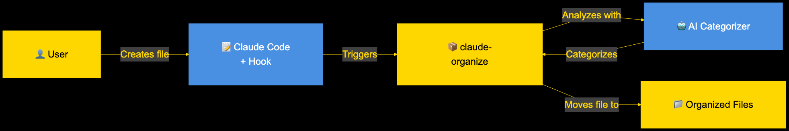
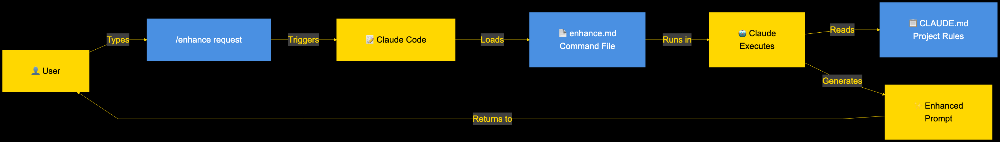
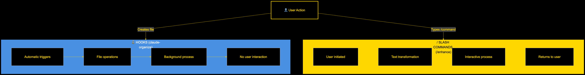

# Claude Organize

<div align="center">

<h3>Intelligent document organization & prompt enhancement for Claude Code</h3>

[](https://www.npmjs.com/package/claude-organize)
[](https://www.npmjs.com/package/claude-organize)
[](https://opensource.org/licenses/MIT)
[](https://github.com/ramakay/claude-organizer/actions/workflows/ci.yml)

**NPM Package**: [https://www.npmjs.com/package/claude-organize](https://www.npmjs.com/package/claude-organize)

</div>

## Two Problems, One Solution

Claude Organize solves two critical problems when working with Claude Code:

### Problem 1: The Messy File Problem 🗂️

Claude Code creates files everywhere. Despite CLAUDE.md instructions saying "don't create scripts in the root directory," it keeps creating test files, debug scripts, and documentation right at your project root:

```
my-project/
├── test-api-v1.md               # First attempt
├── test-api-v2.md               # "Fixed" version
├── test-api-final.md            # "Final" version
├── test-api-final-FIXED.md      # Actually final?
├── debug-webhook.mjs            # Quick test script
├── analyze-performance.mjs      # Debugging session
└── ... (87 more files at root!)
```

**Solution**: Automatic file organization using AI-powered categorization

### Problem 2: The Context Adherence Problem 🧠

Claude Code struggles to maintain project context throughout conversations. You have a detailed CLAUDE.md with project rules, but Claude often:

- **Forgets project guidelines** mid-conversation
- **Ignores file organization rules** when creating new files
- **Loses track of coding standards** over time
- **Requires constant reminders** about project conventions

**Example**: You ask "fix the broken tests" and Claude doesn't remember your rule: "NEVER claim success if tests are failing"

**Solution**: The `/enhance` command with two-pass prompt enhancement

#### Before and After

**Before** (what you type):

```
fix the broken tests
```

**After** `/enhance` (what Claude receives):

```
I need help fixing broken tests in this project.

Context:
- Identify which tests are failing and why
- Review test output and error messages
- Fix the underlying issues causing test failures
- Verify all tests pass after fixes

Requirements:
- Run the full test suite first to see current state
- Fix one test at a time, verifying each fix
- Ensure no regression in other tests
- Document any significant changes made

Project-Specific Rules (from CLAUDE.md):
- NEVER claim success if tests are failing
- ALWAYS verify functionality before declaring completion
- Run lint and typecheck after changes

Success Criteria:
- All tests pass
- No linting errors
- Code changes are minimal and focused
```

**💡 Pro Tip**: Use Shift+P (plan mode) with `/enhance` to review the context selection and prompt engineering before execution

## How Claude Organize Helps

### 🗂️ Automatic File Organization

```
my-project/
├── src/                         # Source code stays untouched
├── docs/
│   ├── testing/                 # Test results organized
│   └── troubleshooting/         # Debug notes in one place
└── scripts/
    ├── checks/                  # Validation scripts grouped
    └── debug/                   # Debug utilities together
```

### 🧠 Two-Pass Prompt Enhancement

```bash
# Your vague request
/enhance fix the broken tests

# Pass 1: Expands using Claude's prompt best practices
✓ Transforms 3 words into comprehensive specification
✓ Adds context, success criteria, and structure

# Pass 2: Integrates relevant CLAUDE.md rules
✓ Includes: "NEVER claim success if tests are failing"
✓ Includes: "ALWAYS verify functionality before declaring completion"
✓ Only adds rules relevant to the task at hand
```

## Quick Start

### Installation

```bash
npm install -g claude-organize
```

### Setup File Organization

You have two options to configure the file organization hook:

#### Option 1: Using Claude's /hooks command (Recommended)

Simply ask Claude to add the hook for you:

```bash
# In Claude Code, just type:
"Add the claude-organize hook using /hooks"

# Claude will use the /hooks command to configure it automatically
```

#### Option 2: Manual Configuration

Add to your `.claude/settings.json`:

```json
{
  "hooks": {
    "PostToolUse": [
      {
        "matcher": "Write|Edit|MultiEdit",
        "hooks": [{ "type": "command", "command": "claude-organize" }]
      }
    ]
  }
}
```

### Use the /enhance Command

The `/enhance` command is automatically installed to `~/.claude/commands/` and ready to use:

```bash
/enhance create a deployment guide
# → Comprehensive prompt with relevant CLAUDE.md rules included
```

## Key Features

### File Organization (Hooks)

✅ **Automatic cleanup** - Files move to proper directories instantly  
✅ **AI categorization** - Understands file purpose from content  
✅ **10 script subcategories** - Detailed organization for scripts  
✅ **Safe defaults** - Protects README, LICENSE, configs  
✅ **Context reduction** - Cleaner workspace = better Claude performance

### Prompt Enhancement (/enhance)

✅ **Two-pass enhancement** - First expands using Claude's best practices, then adds CLAUDE.md rules  
✅ **Prompt engineering** - Transforms vague requests into comprehensive specifications  
✅ **Context engineering** - Selects only relevant project rules  
✅ **CLAUDE.md integration** - Automatically includes applicable guidelines  
✅ **Smart detection** - Understands task type from your request  
✅ **Efficient prompts** - No rule dumping, only what's needed  
✅ **Works in plan mode** - Compatible with Claude's planning features

## Architecture

### How It All Works



**File Organization**: User → Claude Code → Hook → claude-organize → AI → Organized Files

### The /enhance Command Flow



**Prompt Enhancement**: User → /enhance → Reads CLAUDE.md → Context Analysis → Enhanced Prompt

### Hooks vs Slash Commands



- **Hooks**: Automatic, background file organization
- **Slash Commands**: Interactive, user-initiated enhancements

[View all architecture diagrams →](docs/architecture/)

## Documentation

| **Guide**                                                   | **Description**                          |
| ----------------------------------------------------------- | ---------------------------------------- |
| 📖 [Full Documentation](docs/)                              | Complete feature guide and API reference |
| 🚀 [Quick Start](docs/quick-start.md)                       | Get up and running in 5 minutes          |
| 📂 [Subcategories Guide](docs/subcategories.md)             | Script organization patterns             |
| ⚙️ [Configuration](docs/configuration.md)                   | Customize behavior and settings          |
| 🔧 [JavaScript Organization](docs/js-organization-guide.md) | Experimental JS/MJS features             |
| 🛠️ [Troubleshooting](docs/troubleshooting/)                 | Common issues and solutions              |

## Categories

Files are automatically organized into these directories:

### Documentation

- `docs/testing/` - Test results, QA reports
- `docs/analysis/` - Data analysis, performance reports
- `docs/architecture/` - System design, technical docs
- `docs/operations/` - Deployment guides, runbooks
- `docs/troubleshooting/` - Debug logs, issue investigations

### Scripts

- `scripts/checks/` - Verification and validation utilities
- `scripts/testing/` - Test scripts and runners
- `scripts/deployment/` - Deployment and release scripts
- `scripts/utilities/` - General utility scripts
- [+ 6 more subcategories](docs/subcategories.md)

## Common Scenarios

### The "Create and Run" Learning Curve

You might encounter this scenario:

```
Claude: "I'll create test-email.mjs and run it"
*Creates file*
*File gets organized to scripts/testing/*
Claude: "Error: Cannot find module './test-email.mjs'"
```

**This is intentional!** The friction teaches Claude (and us) better habits:

1. **First time**: Claude learns files don't stay at root
2. **Second time**: Claude checks where files went (`find . -name "test-email.mjs"`)
3. **Third time**: Claude runs directly from organized location

Just like training a junior developer: "Test files go in the test directory."

**Pro tip**: Use `/enhance` to help Claude understand the project structure:

```bash
/enhance create and test email functionality
# The enhanced prompt will remind Claude about automatic organization
```

### Why This Matters

The housekeeper doesn't compromise on cleanliness. This "friction" is actually a feature:

- Claude learns project structure through experience
- Better long-term habits > short-term convenience
- Consistent organization > temporary files at root

## Other Slash Commands

- `/claude-organize-bypass` - Toggle file organization on/off
- `/claude-organize-add <pattern>` - Add patterns to be organized
- `/claude-organize-js` - Enable JavaScript organization (experimental)

## Safety & Disclaimers

**⚠️ USE AT YOUR OWN RISK**: Claude Organize moves files in your project. Always use version control and test in a safe environment first.

- ✅ **Use version control** (Git) before enabling
- ✅ **Test in a safe environment** first
- ✅ **Review the organization log** at `docs/organization-log.json`

## Contributing

We welcome contributions! Please see our [Contributing Guide](CONTRIBUTING.md) for details.

## License

Distributed under the MIT License. See [LICENSE](LICENSE) for more information.

## Support

- 📝 [Report Issues](https://github.com/ramakay/claude-organize/issues)
- 💬 [Discussions](https://github.com/ramakay/claude-organize/discussions)
- 📧 [Contact](mailto:your-email@example.com)

---

<div align="center">
Made with ❤️ by <a href="https://github.com/ramakay">Rama Annaswamy</a>
</div>
