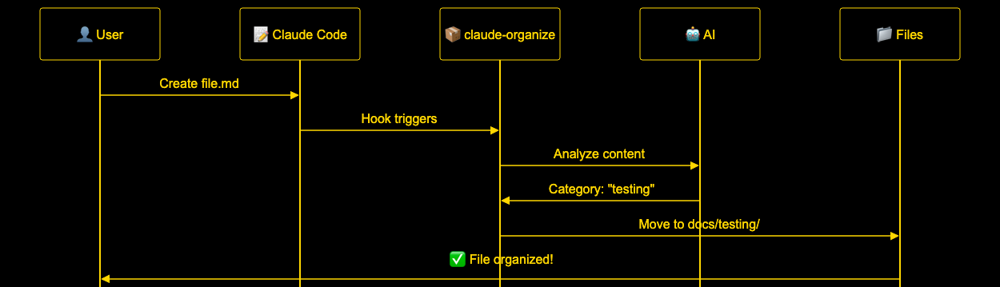

# Claude Organize Architecture Diagrams

This directory contains visual architecture diagrams for the claude-organize project, generated using mermaid-cli with a dark theme featuring blue and gold colors for optimal readability.

## Diagrams

### 1. Architecture Overview (Simplified)


**File**: `architecture.mmd`

Simplified flowchart showing the core claude-organize flow:

- User → Claude Code → claude-organize → AI Categorizer → Organized Files
- Minimal components for clarity
- Gold and blue color scheme on black background

### 2. Sequence Flow (Simplified)



**File**: `sequence.mmd`

Essential 6-step sequence:

1. User creates file.md
2. Hook triggers claude-organize
3. AI analyzes content
4. Returns category
5. File moves to organized location
6. User sees success

### 3. /enhance Command Flow


**File**: `enhance-command.mmd`

Shows how the `/enhance` slash command works:

- User types `/enhance` request
- Claude Code loads command from `~/.claude/commands/enhance.md`
- Claude executes with context-aware CLAUDE.md integration
- Returns enhanced prompt to user

### 4. Hooks vs Slash Commands


**File**: `hooks-vs-commands.mmd`

Comparison of two different extension mechanisms:

- **Hooks**: Automatic, background, file-triggered (claude-organize)
- **Slash Commands**: User-initiated, interactive, text transformation (/enhance)

## Theme Configuration

**File**: `mermaid-config.json`

The diagrams use a custom dark theme with:

- Background: `#0d1117` (GitHub dark mode)
- Primary: `#1e3a5f` (Dark blue)
- Accent: `#FFD700` (Gold)
- Secondary: `#4A90E2` (Bright blue)
- Font: 20px Arial for maximum readability

## Generating Diagrams

To regenerate the diagrams:

```bash
./generate-diagrams.sh
```

Requirements:

- Node.js and npm
- mermaid-cli: `npm install -g @mermaid-js/mermaid-cli`

The script will:

1. Generate PNG images at 2400px width
2. Apply the dark theme configuration
3. Open the generated images (on macOS)

## Viewing Options

The diagrams are designed to be readable:

- ✅ At normal screen viewing distance
- ✅ Without zooming or opening full size
- ✅ On both light and dark backgrounds
- ✅ When embedded in documentation

## Integration with GitHub Pages

These diagrams are also displayed on the project's GitHub Pages site at:
https://ramakay.github.io/claude-organize/

The Mermaid source files can be rendered directly in GitHub markdown, though the custom theme won't apply in that context.
