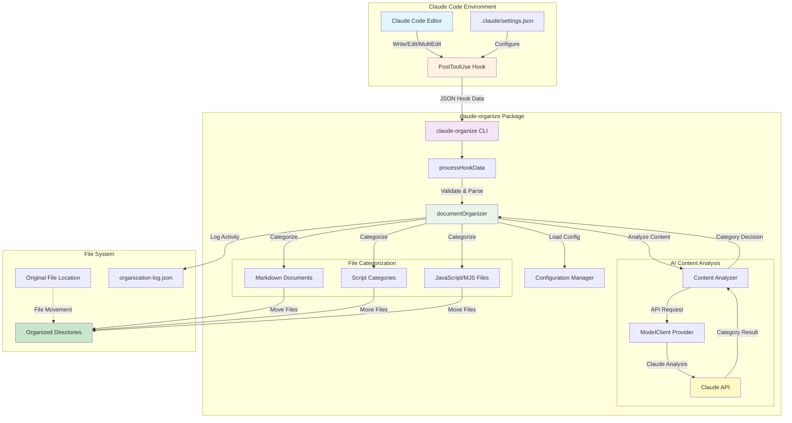
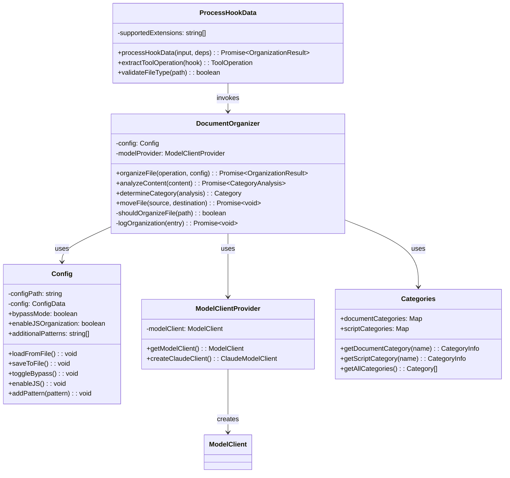
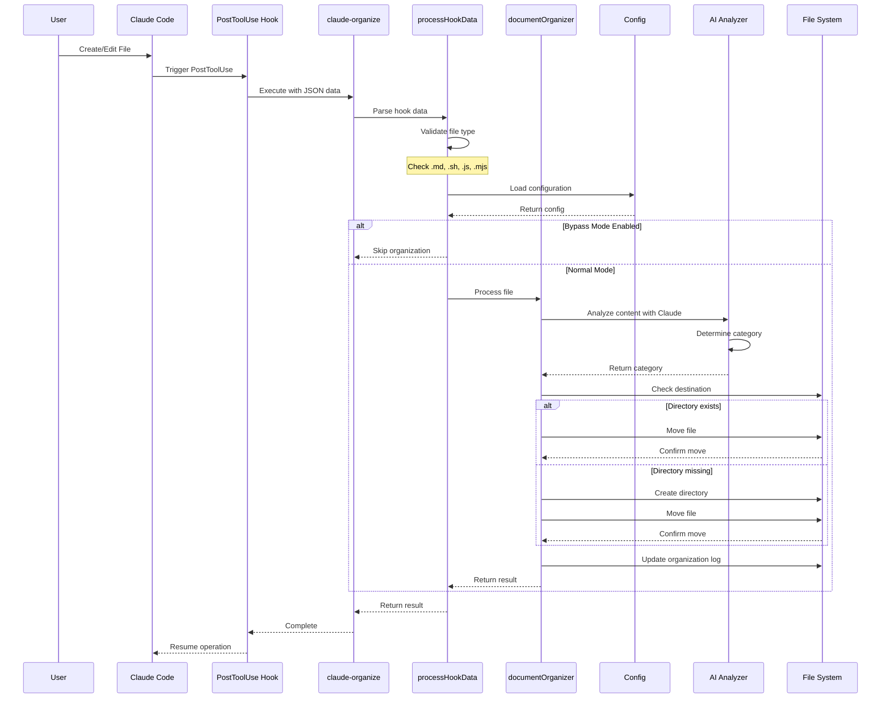
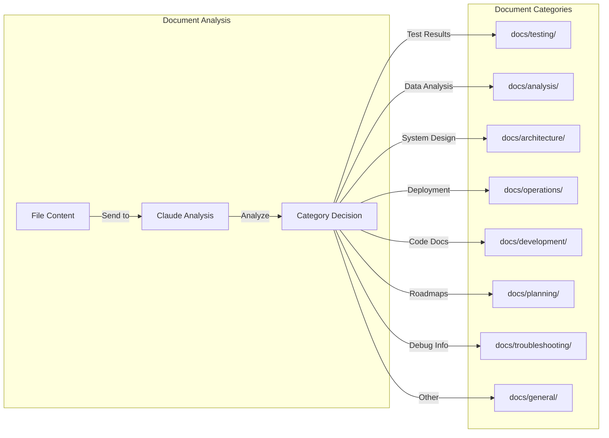
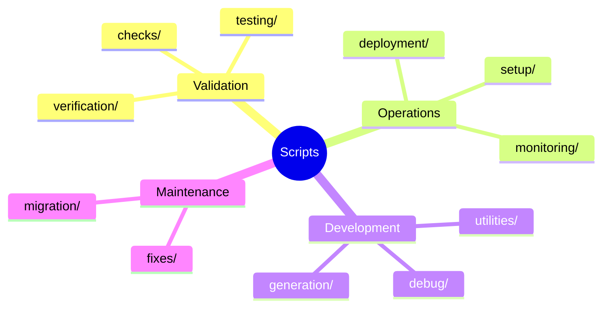
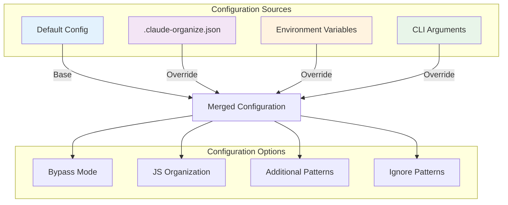
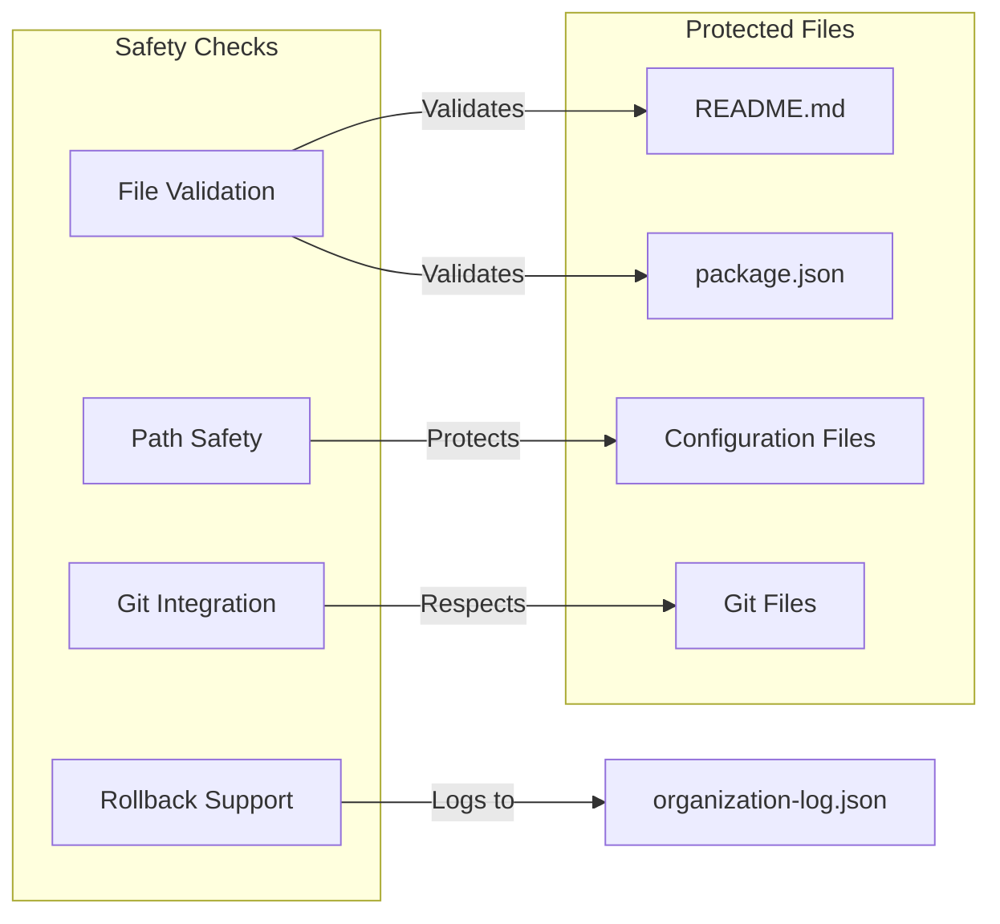

# Claude Organize Architecture

Claude Organize is an intelligent document organization system for Claude Code that automatically categorizes and moves files based on their content using AI-powered analysis.

## System Overview

The following diagram shows how Claude Organize integrates with Claude Code through PostToolUse hooks to automatically organize files:



## Component Architecture

The system is built with a modular architecture that separates concerns and allows for easy extension:



## Data Flow Sequence

This sequence diagram shows the complete flow from file creation to organization:



## File Organization Categories

### Document Categories

The system intelligently categorizes markdown documents based on their content:



### Script Subcategories

Scripts are organized into purpose-based subcategories:



## Configuration System

The configuration system supports multiple levels of customization:



## Integration with Claude Code

### Hook Configuration

```json
{
  "hooks": {
    "PostToolUse": [
      {
        "matcher": "Write|Edit|MultiEdit",
        "hooks": [
          {
            "type": "command",
            "command": "claude-organize"
          }
        ]
      }
    ]
  }
}
```

### Slash Commands

The system provides several slash commands for user control:

- `/claude-organize-bypass` - Toggle bypass mode
- `/claude-organize-add <pattern>` - Add file patterns
- `/claude-organize-js` - Enable JavaScript organization
- `/enhance` - Transform requests into structured prompts

## Safety Features



## Performance Considerations

- **Async Operations**: All file operations are asynchronous
- **Caching**: Environment configurations are cached
- **AI Throttling**: Claude API calls are managed efficiently
- **Logging**: Comprehensive logging without performance impact

## Future Architecture Enhancements

1. **Plugin System**: Allow custom categorizers
2. **Multi-Model Support**: Integration with other AI providers
3. **Real-time Monitoring**: WebSocket-based file watching
4. **Cloud Sync**: Synchronize organization rules across teams

---

<small>This architecture documentation is automatically generated and kept in sync with the codebase. Last updated: {{ 'now' | date: '%Y-%m-%d' }}</small>
